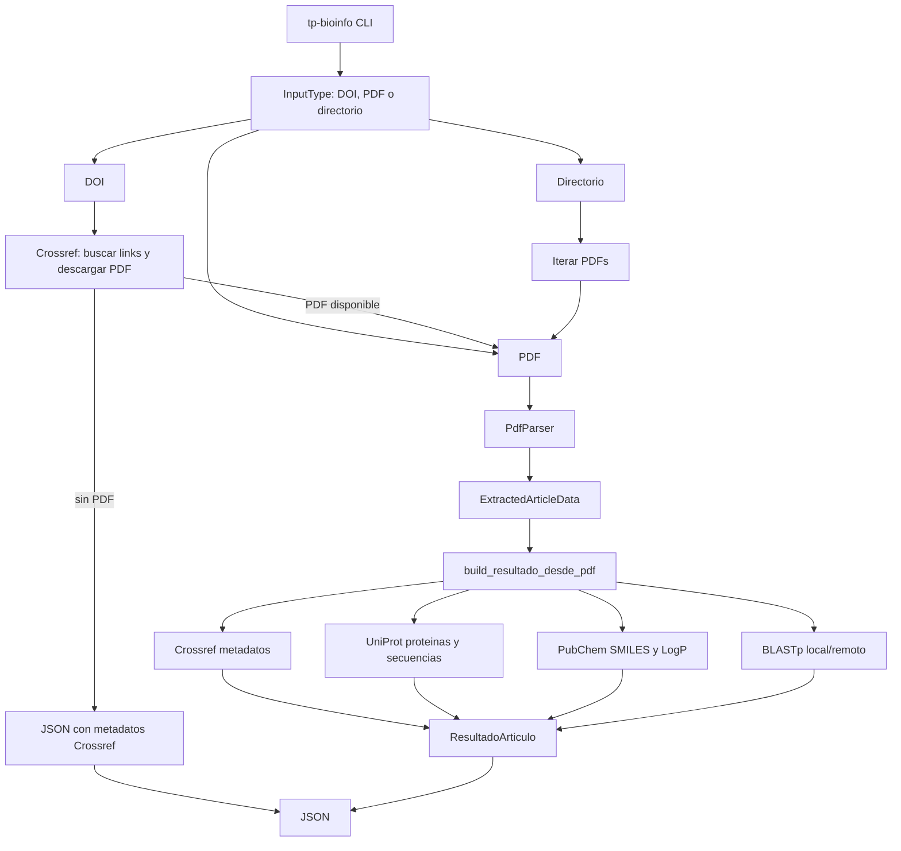
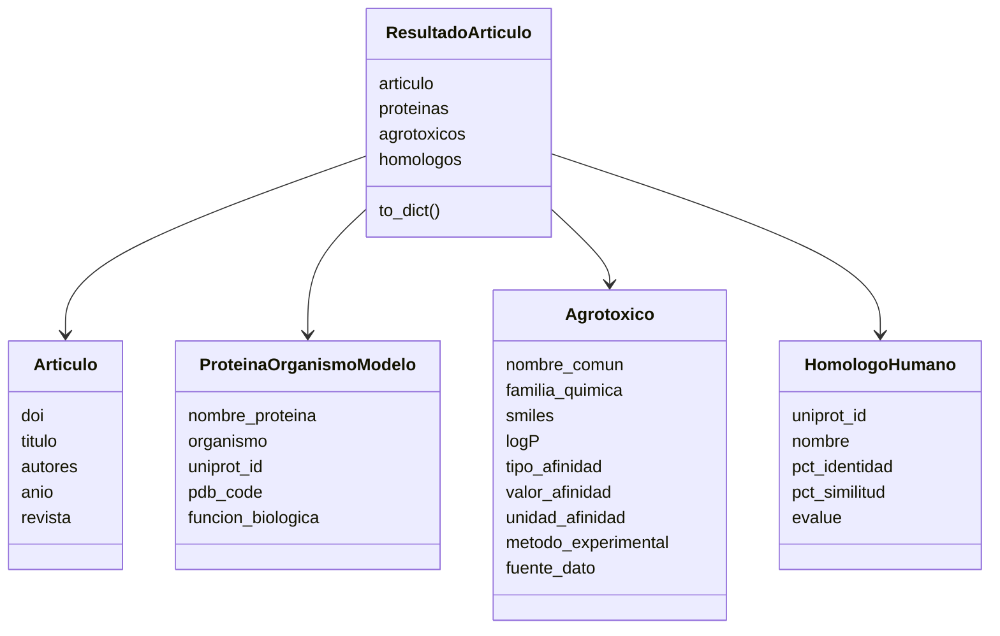

# Arquitectura del proyecto

## Objetivo

La aplicacion es una CLI Python que procesa articulos cientificos relacionados con proteinas tipo lipocalina, odorant-binding proteins (OBP), chemosensory proteins (CSP) y agrotoxicos. A partir de un PDF, un directorio de PDFs o un DOI, produce un JSON por articulo con informacion bibliografica, proteinas candidatas, compuestos investigados y homologos humanos cuando se ejecuta BLAST.

El diseno prioriza una ejecucion simple desde terminal, empaquetado portable con `setuptools` y servicios externos desacoplados en modulos propios.

## Vista general



## Entrada y CLI

El punto de entrada esta en `src/app.py`.

La CLI se instala desde `pyproject.toml` mediante:

```toml
[project.scripts]
tp-bioinfo = "app:main"
```

La clase `InputType` clasifica el argumento principal en:

- `doi`: cadena compatible con el patron DOI.
- `pdf`: archivo local con extension `.pdf`.
- `dir`: directorio local con PDFs.
- `file`: otro archivo existente; por ahora solo se informa.

Opciones principales:

- `--output-dir`: directorio de salida para JSON.
- `--skip-blast`: omite la busqueda de homologos humanos.
- `--blast-mode`: selecciona BLAST `remote` o `local`.
- `--pdf-dir`: directorio para PDFs descargados desde DOI.

## Flujo por tipo de entrada

### PDF

1. `procesar_pdf` recibe el path.
2. `build_resultado_desde_pdf` llama a `parse_pdf`.
3. El parser extrae DOI, titulo tentativo, organismos, proteinas candidatas, agrotoxicos, familias quimicas, afinidades, metodos y PDB.
4. Se enriquecen metadatos con Crossref si hay DOI.
5. Se consultan proteinas candidatas en UniProt.
6. Se consultan agrotoxicos en PubChem.
7. Si BLAST esta habilitado, se buscan homologos humanos.
8. `guardar_resultado` escribe el JSON.

### Directorio

1. La CLI lista `*.pdf` dentro del directorio.
2. Ordena los archivos.
3. Ejecuta el flujo PDF para cada uno.
4. Genera un JSON por PDF.

### DOI

1. `download_pdf_from_doi` consulta Crossref.
2. Si Crossref devuelve links PDF o links Frontiers derivables a `/pdf`, intenta descargar el PDF.
3. La descarga se acepta solo si el contenido empieza con `%PDF`.
4. Si hay PDF valido, se ejecuta el flujo PDF completo.
5. Si no hay PDF descargable, se genera un JSON fallback con metadatos bibliograficos de Crossref.

Este fallback permite que la CLI siempre produzca una salida razonable cuando el publisher bloquea el PDF o no publica link directo.

## Parser de PDFs

Modulo: `src/utils/pdf_parser.py`.

Responsabilidades:

- Extraer texto con `pdfplumber`.
- Detectar DOI con regex y recomponer casos donde el DOI queda partido por salto de linea.
- Inferir titulo desde las primeras lineas utiles.
- Normalizar casos de texto extraido con glifos duplicados.
- Detectar organismos por nombre cientifico o nombres comunes conocidos.
- Detectar proteinas candidatas asociadas a lipocalinas, OBP y CSP.
- Detectar agrotoxicos por vocabulario controlado.
- Mapear familias quimicas conocidas.
- Extraer afinidades simples: `Kd`, `Ki`, `IC50`, `EC50`.
- Detectar metodos experimentales por palabras clave.
- Extraer codigos PDB cuando aparecen explicitamente.

La salida intermedia del parser es `ExtractedArticleData`, que funciona como DTO entre parser y capa de enriquecimiento.

## Enriquecimiento externo

### Crossref

Modulo: `src/services/crossref_service.py`.

Funciones:

- Recuperar titulo, autores, anio y revista.
- Obtener links de PDF asociados al DOI.
- Descargar PDFs desde DOI con validacion de contenido.
- Manejar errores HTTP, respuestas no PDF y cortes de streaming.

### UniProt

Modulo: `src/services/uniprot_service.py`.

Funciones:

- Buscar una proteina por nombre y organismo.
- Extraer accession UniProt, organismo y funcion biologica cuando la API la devuelve.
- Descargar secuencia FASTA para BLAST.

### PubChem

Modulo: `src/services/pubchem_service.py`.

Funciones:

- Buscar compuestos por nombre comun.
- Obtener SMILES y LogP.
- Guardar la fuente como `PubChem PUG REST`.
- Mantener la familia quimica inferida por el parser.

### BLAST

Modulo: `src/services/blast_service.py`.

Soporta dos modos:

- `remote`: usa `Bio.Blast.NCBIWWW.qblast` contra `swissprot` filtrando `Homo sapiens`.
- `local`: usa `blastp.exe` y una base local del proteoma humano UniProt.

Para cada hit se guarda:

- ID UniProt humano.
- Nombre de proteina.
- Porcentaje de identidad.
- Porcentaje de similitud.
- E-value.

El resultado final se ordena por E-value y se limita a 15 homologos.

## Modelo de datos

Los modelos estan en `src/models`.



El JSON final tiene cuatro claves principales:

```json
{
  "articulo": {},
  "proteinas": [],
  "agrotoxicos": [],
  "homologos_humanos": []
}
```

## Empaquetado

El proyecto usa layout `src/` y `setuptools`.

Configuracion principal:

```toml
[tool.setuptools]
py-modules = ["app"]

[tool.setuptools.packages.find]
where = ["src"]
include = ["models*", "services*", "utils*"]
```

Esto instala:

- `app.py` como modulo de entrada.
- `models`.
- `services`.
- `utils`.

El comando `tp-bioinfo` queda disponible al instalar con:

```powershell
pip install -e .
```

o desde un wheel:

```powershell
python -m build --wheel
pip install dist\tp_bioinfo-0.1.0-py3-none-any.whl
```

## Tests

La suite esta en `tests/`.

Cobertura principal:

- `test_app.py`: CLI, entrada DOI/PDF/directorio, armado de resultados y guardado JSON.
- `test_services.py`: Crossref, descarga PDF, PubChem, UniProt con mocks.
- `test_pdf_parser.py`: extraccion de DOI, titulo, organismos, proteinas, agrotoxicos, afinidades y PDB.
- `test_blast_local.py`: normalizacion de resultados BLAST y prueba opcional con BLAST local.
- `test_packaging.py`: configuracion de empaquetado.

Los tests unitarios no dependen de red. La prueba de BLAST local se saltea si no existe el binario o la base local.

## Salidas y ejemplos

La CLI escribe salidas en `output/` por defecto, carpeta ignorada por Git.

Las salidas versionadas viven en:

```text
outputs/examples/
```

Incluyen ejemplos con:

- PDF local con agrotoxicos.
- PDF local con afinidad.
- DOI con descarga de PDF.
- DOI con fallback Crossref.
- BLAST local con 15 homologos humanos.

## Decisiones y limitaciones

- El parser usa heuristicas y vocabularios controlados; no pretende reemplazar curacion manual.
- La asignacion de afinidad al primer agrotoxico detectado es una simplificacion.
- BLAST remoto puede tardar varios minutos y depender de colas externas.
- BLAST local es preferido para pruebas reproducibles.
- Algunos publishers exponen link PDF en Crossref pero bloquean la descarga con HTTP 403.
- Algunos campos pueden quedar `null` cuando el articulo no reporta el dato o la API externa no lo devuelve.

## Extension futura

Mejoras naturales:

- Cache de secuencias UniProt y resultados BLAST.
- Ranking mas preciso de proteinas candidatas.
- Asociacion afinidad-compuesto basada en contexto cercano.
- Consulta adicional a PDB para completar estructuras no mencionadas en texto.
- Soporte opcional para BindingDB o ChEMBL.
- Opcion `--max-blast-proteins` para controlar tiempos en BLAST remoto.

